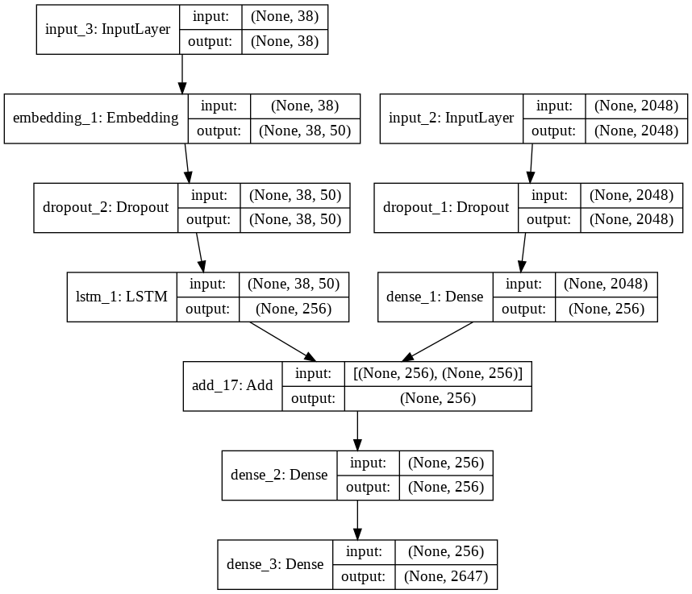

# Image Caption Generator
Deep Learning and Neural Networks have revolutionized both Natural Language Processing (NLP) and Computer Vision. Before the advent of Deep Learning, statistical and Machine Learning techniques were prevalent, especially in NLP. However, Neural Networks have proven to be highly effective for more complex tasks. With the growth in dataset sizes and advancements in computational tools, Deep Learning is increasingly applied and researched across various fields.

The breakthrough of Convolutional Neural Networks (CNNs) came in 2012 with the Google ImageNet Challenge (ILSVRC), showcasing their prowess in visual tasks. CNNs are particularly advantageous due to their translation invariance, allowing them to recognize patterns across different regions of an image efficiently—something that was computationally intensive with traditional feed-forward networks. Stacking multiple convolutional layers enables the model to learn features hierarchically: initial layers detect basic elements like edges and lines, while deeper layers combine these to identify more complex patterns. In this project, we leverage ResNet50, a popular CNN architecture, to extract features from images.

For caption generation, we use Long Short-Term Memory (LSTM) networks, a specialized type of Recurrent Neural Network (RNN). Unlike Dense layers, RNNs process data sequentially, integrating new information with previously processed data at each step. This sequential processing makes LSTMs particularly effective for handling and generating textual sequences.

## Model Engineering
This project utilizes the ResNet50 architecture for extracting image features. ResNets, or Residual Networks, gained prominence after winning the 2015 ImageNet Challenge. They enable the training of very deep neural networks, like the original ResNet with 152 layers, by addressing the vanishing gradient problem through Skip Connections, which provide alternative paths for gradient flow. ResNet50, a smaller variant of ResNet152, is commonly used for Transfer Learning and comes preloaded with weights trained on the ImageNet dataset in Keras. For this project, the last classification layer is removed, and the network is used solely for feature extraction. Encoded features for training and test images are saved in "encoded_train_features.pkl" and "encoded_test_features.pkl," respectively.

## Live Demo
You can try out the Image Caption Generator live in the following demo:[Here](https://imagecaptiongenerator-z5qyrcrynnjdrkeghzk6ms.streamlit.app/)
